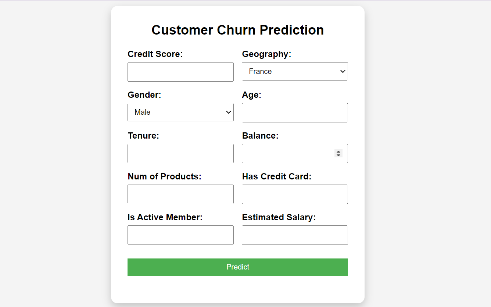
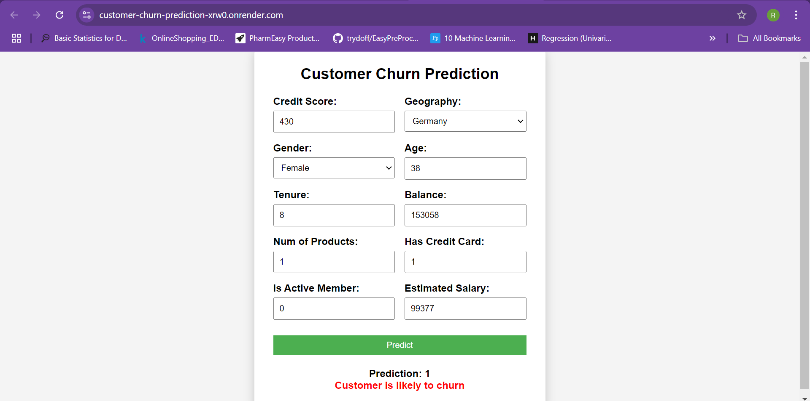

# Customer Churn Prediction

## Introduction:
Customer churn is a critical issue in the banking industry. Identifying customers who are likely to leave enables banks to take proactive measures to retain them. This project involves building a machine learning model to predict customer churn and deploying it as a web application for easy accessibility.

## Problem Statement:
Banks face significant losses due to customer churn. The goal of this project is to develop a predictive model that can identify customers who are at risk of leaving based on their historical data, demographics, and behavioral patterns.

## Data Collection & Preprocessing:
### Dataset: 
The dataset consists of customer information, financial attributes, and behavioral metrics. Below is a description of the key features:
1.	RowNumber: Unique index for each customer record.
2.	CustomerId: Unique identifier assigned to each customer.
3.	Surname: Last name of the customer (not relevant for prediction but can be used for grouping).
4.	CreditScore: Customer’s credit score, indicating financial responsibility.
5.	Geography: Country where the customer resides.
6.	Gender: Customer’s gender (Male/Female).
7.	Age: Customer’s age in years.
8.	Tenure: Number of years the customer has been with the bank.
9.	Balance: Account balance of the customer.
10.	NumOfProducts: Number of bank products the customer is using.
11.	HasCrCard: Whether the customer owns a credit card (1 = Yes, 0 = No).
12.	IsActiveMember: Whether the customer is an active bank member (1 = Active, 0 = Inactive).
13.	EstimatedSalary: Estimated annual salary of the customer.
14.	Exited: Target variable (1 = Customer churned, 0 = Customer retained).

### Preprocessing Steps: 
1. Handling missing values:
No missing values were present in the dataset.

2. Encoding categorical variables:
Categorical variables (Gender and Geography) were encoded using One-Hot Encoding.

3. Feature scaling:
Feature scaling was applied to numerical variables to standardize the dataset.

4. Balancing the dataset:
The dataset was imbalanced, so Synthetic Minority Over-sampling Technique (SMOTE) was applied to balance the classes.

## Exploratory Data Analysis (EDA):

## Feature Engineering:

## Model Development
### Algorithm Used: 
1. Logistic Regression: Used as a baseline model due to its simplicity and interpretability.
2. Random Forest: An ensemble learning method providing high accuracy and feature importance insights.
3. Gradient Boosting (XGBoost): A powerful boosting algorithm that optimizes performance by sequentially improving weak learners.

### Model Training & Evaluation: 

## Web Application Development
Developed fronend using HTML,CSS and Javascript for an interactive and user-friendly interface.
And implemented backend using Flask to handle model inference and API requests.

## Model Deployment
weblink : https://customer-churn-prediction-xrw0.onrender.com 

## Conclusion
The developed model successfully predicts customer churn and is accessible via a web application. This can help banks implement targeted retention strategies, thereby reducing customer attrition and improving customer satisfaction.

## Future Enhancements
Improving model performance with deep learning techniques
Incorporating real-time data streams
Enhancing web app UI/UX for better user experience

